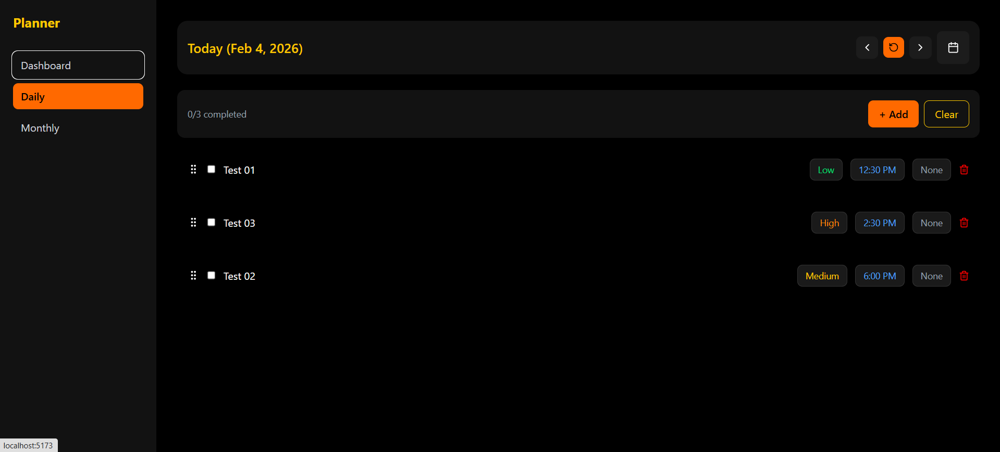
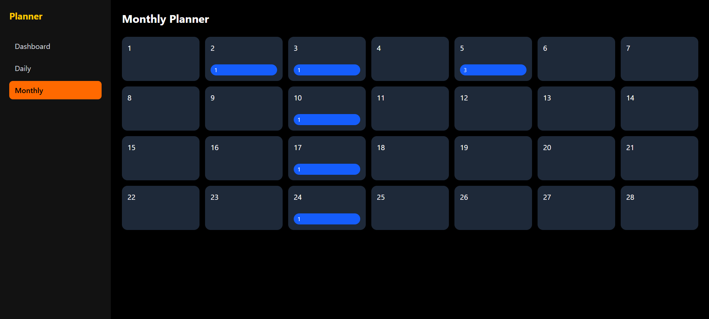

# 🗓️ Planora

A modern daily & monthly productivity planner built with React + TypeScript.

Planora helps you organize tasks, schedule your day, and visualize plans using a clean calendar interface — with upcoming Google Calendar sync and PWA support.

---

## ✨ Features

### ✅ Daily Planner
- Add / edit / delete tasks
- Time scheduling
- Priority levels
- Recurring tasks (daily / weekly)
- Drag & drop reordering
- Mark complete with strike-through

### ✅ Calendar
- Custom dark-themed mini calendar
- Month navigation
- Quick date selection
- Today shortcut
- (Upcoming) Google Calendar events

### ✅ Productivity UX
- Black + gold + orange premium theme
- LocalStorage persistence
- Responsive design
- Smooth interactions

### 🚀 Coming Soon
- Google Calendar sync
- Monthly planner view
- Notes
- Dashboard analytics
- PWA offline mode
- Backend API (Laravel)

---

## 🛠️ Tech Stack

Frontend:
- React
- TypeScript
- Vite
- TailwindCSS
- DnD Kit

Icons:
- Lucide React

Storage:
- LocalStorage (temporary)
- Backend (planned)

---

## 📸 Screenshots

> 

> 

---

## ⚙️ Installation

```bash
git clone https://github.com/yourusername/planora.git
cd planora
npm install
npm run dev
```
## Open: http://localhost:5173

## 🧩 Project Structure

```bash
src/
 ├─ components/
 │   ├─ TaskTable
 │   ├─ MiniCalendar
 │   └─ Layout
 ├─ pages/
 │   ├─ Daily
 │   ├─ Monthly
 │   └─ Dashboard
 ├─ utils/
 ├─ styles/
 └─ main.tsx
```

## 📦 Build

npm run build
npm run preview

## 📄 License

MIT